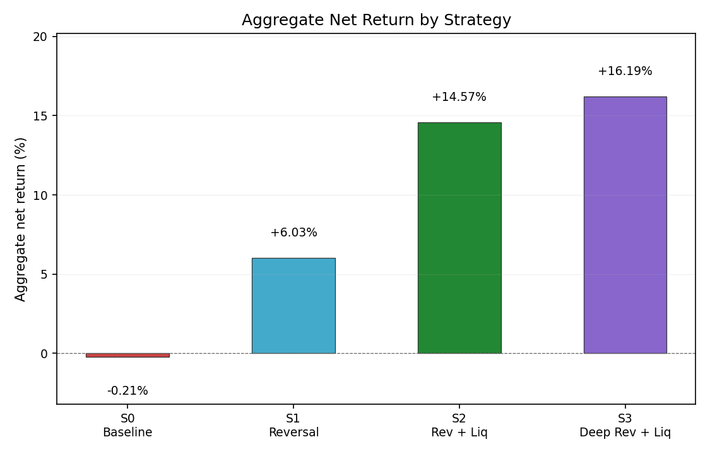

# Strategy Project: IPO / New Listing Daily Strategy Research

本项目选择：策略方向。完成目录：`strategy-project/`。

## 最终主推策略：S2 reversal_liquidity

本项目评估了 4 个策略版本，但**最终主推策略只有一个：S2 reversal_liquidity**。

S2 的信号定义为 `day1_return < 0` 且 `first_day_turnover` 高于样本中位数，在次日开盘买入，持有最多 3 个交易日，设有 -8% stop-loss 和 +20% take-profit。

| 策略 | 信号 | 角色 |
|------|------|------|
| **S0 baseline_momentum** | `day1_return > 0.05` | 题目要求的官方 baseline，保留用于对比 |
| **S1 reversal** | `day1_return < 0` | diagnostic / 方向验证，确认首日下跌后反转方向成立 |
| **S2 reversal_liquidity** | `day1_return < 0` 且 turnover > 样本中位数 | **最终主推策略（唯一结论）** |
| **S3 reversal_liquidity_deep** | `day1_return < -0.05` 且 turnover > 样本中位数 | sensitivity variant only，不作为主结论 |

S0 / S1 / S3 不是与 S2 竞争的最终推荐。完整 trade log 通过 `strategy_version` 列区分所有已评估的策略版本。关键指标使用 `aggregate_net_return`（portfolio-level），而非 `summed_net_return`（per-trade 加总）。



## 复现步骤（本地 fallback，Windows 环境下实际使用）

```bash
cd strategy-project
python src/download_data.py --source-root ../research-data
python src/build_features.py
python src/backtest.py
python -m pytest tests/test_strategy_scaffold.py -v
```

## 复现步骤（官方 API 路径）

前提：从仓库根目录启动 mock research API：

```bash
# 仓库根目录，单独终端
make serve-research
```

然后：

```bash
cd strategy-project
python src/download_data.py --base-url http://127.0.0.1:9041 --start 2026-01-01
python src/build_features.py
python src/backtest.py
python -m pytest tests/test_strategy_scaffold.py -v
```

两种路径产生的 `data/raw/` 输出完全一致。

## 本地 fallback 说明

Windows PowerShell 没有 `make`，且 mock API 未在 9041 端口启动。`download_data.py` 提供 `--source-root` 显式支持的本地备选路径，直接从 `../research-data/` 读取 parquet/JSON 并生成标准化 raw 文件。

## 原始数据（已验证）

| 文件 | 内容 |
|------|------|
| `data/raw/ipo_universe.parquet` | 65 支股票 |
| `data/raw/daily_bars.parquet` | 3,673 行，2026-01-02 至 2026-06-15 |
| `data/raw/cost_model.json` | buy 12 bps, sell 22 bps, slippage 10 bps/side, min HKD 5 |
| `data/raw/coverage_summary.json` | 0 缺失，0 重复 |

HKD 100,000 notional round-trip 成本约 HKD 540（0.54%）：
buy fee HKD 120 + sell fee HKD 220 + buy slippage HKD 100 + sell slippage HKD 100。

## 输出文件

| 文件 | 说明 |
|------|------|
| `reports/research_report.md` | 完整研究报告，含 strategy comparison、cost sensitivity、holding sensitivity、outlier attribution、time-aware liquidity robustness、Barra 风险控制说明 |
| `reports/trades.csv` | 78 笔 trade，通过 `strategy_version` 列区分 4 个策略 |
| `reports/metrics.json` | 所有策略指标、cost sensitivity、holding sensitivity、outlier analysis、time-aware liquidity |
| `reports/external_data_audit.md` | 外部数据来源质量审计（10 支 pilot） |
| `reports/figures/strategy_aggregate_net_return_comparison.png` | 各策略 aggregate net return 对比柱状图 |

## 测试

```bash
python -m pytest tests/test_strategy_scaffold.py -v
```

22 个测试覆盖：feature 列 schema、signal 数量验证、baseline_signal 别名 invariant、trade log 精确 15 列、exit_reason 合法性、PnL 一致性、backward compatibility、HKD 540 round-trip cost 验证、cost scaling / slippage 方向 / min fee、metrics schema、空 trade 边界情况。

## 外部数据

仅收集了 10 支股票的 pilot。来源为第三方财经媒体（HK StockStar、AASTOCKS、HKET、Futu），非直接 HKEX 文件。数据存储在 `data/external/ipo_info.csv` 和 `grey_market.csv`。所有外部数据**不进入核心回测信号**，仅用于报告背景讨论。

缺失值保留为空，不填零。

## 局限性

- 样本量有限：本项目只覆盖 65 支 IPO，时间窗口为 2026-01-02 至 2026-06-15，结果更适合作为样本内研究结论，而非长期稳定性证明。
- 主回测中的 liquidity filter 使用全样本 first_day_turnover 中位数，属于 exploratory 设定；报告中额外提供了 time-aware prior-median liquidity check，作为对 lookahead 风险的稳健性验证。
- 当前数据只包含日线 OHLCV 和成本模型，不包含完整市场截面、行业、市值、估值、beta 或 Barra-style factor exposures，因此未做正式因子中性化。
- 本项目未进行收益最大化式调参。S0 的 5% 阈值来自题目 baseline；S1/S2/S3 用于 baseline comparison、方向验证和 sensitivity 分析。
- 外部 IPO / 暗盘数据仅做 10-symbol pilot，用于背景说明和数据可靠性讨论，不进入核心信号生成或回测。
- **本项目为实习研究任务，不构成生产交易建议。**

## 代码结构

```
src/
├── paths.py          # 路径常量
├── costs.py          # 成本模型、slippage 计算
├── build_features.py # 特征构建、signal 列生成
├── strategy.py       # 交易生成（参数化 signal_column 和 strategy_version）
├── metrics.py        # 指标计算（含 max_drawdown）
├── backtest.py       # 多策略回测、cost sensitivity、holding sensitivity、outlier、time-aware liquidity
├── report_tables.py  # 研究报告生成（markdown 表格 + 所有章节）
└── download_data.py  # 数据下载（API 或本地 fallback）
```

所有策略参数（signal_column、strategy_version、holding_days、stop_loss_pct、take_profit_pct）均为函数参数，非硬编码。
